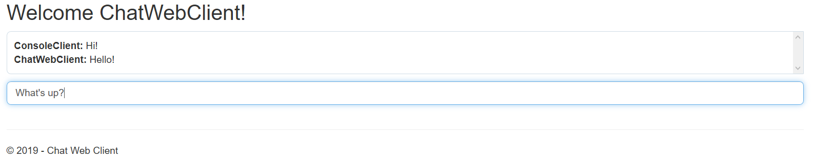
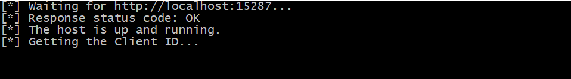
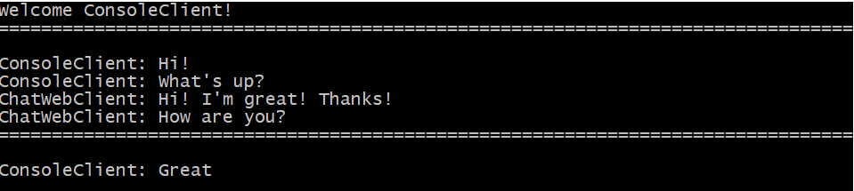

# Overview

This is a simple *proof of concept* project that shows how to use [SignalR](https://dotnet.microsoft.com/apps/aspnet/signalr)
in conjunction with Angular 7 and ASP.NET MVC 5 applications. That's because most of materials 
available today focus on building real-time connections between an Angular application
and ASP.NET Core solutions. Such example, showing how to work with a little bit
older technology, might come in handy, especially for someone responsible for maintaining
older systems. The trick is to use the right SignalR library, for Angular, that's compatible
with ASP.NET SignalR, for example: [ng2-signalR](https://www.npmjs.com/package/ng2-signalr).

It's a simple chat application (very refreshing) that consists of the following components:

* **ChatConsoleClient** - client application with text UI.
* **ChatWebClient** - web application built with ASP.NET MVC 5 and Angular 7.
* **ChatWebClient.Dispatcher** - a task that works in a background, responsible for sending messages to the web application.
* **Server** - a hub responsible for communication between the clients.

Please, keep in mind that it's just a proof of concept that focuses on SignalR communication
between the web client application and the web server application. Hence, other concepts
used in this demo should be verified carefully before using them in production.

# How to use it?

To run the demo, at least three applications must be opened:

## ChatWebClient

It can be hosted on IIS (how to do it is out of the scope of this document, so please, check other sources. For example:
[Hosting ASP.NET MVC Application On IIS](http://www.compilemode.com/2018/02/hosting-asp-net-mvc-application-on-iis.html)) or
execute the application from Visual Studio (using IIS Express).



The unique client ID can be determined in the `Web.config` file, under the `<appSettings>` section (`ClientId` key).

## ChatWebClient.Dispatcher

Set up the URL of aforementioned web application in the config file (`ChatWebClient.Dispatcher.exe.config`, the `ChatWebClient.BaseUri` key under
the `appSettings` section) and run the application (`ChatWebClient.Dispatcher.exe`). It waits until the web application is up and then, it listens 
for new messages on the server and sends them to the web application.



## ChatConsoleClient

Run the application with the unique client ID as a parameter: `ChatConsoleClient.exe <CLIENT_ID>` and that's it! To exit the application, just type `/exit` and
hit ENTER.



## Additional features

Please note, that multiple instances of web application and console applications can be executed. Just remember to give a unique client ID for each application.

**Warning: all chat applications must run on the same machine as they use Memory-Mapped Files for inter-process communication.**

You can also send secret messages to a specific client. All you have to do is to format the message as follows:

```
@RECIPIENT_CLINET_ID: MY MESSAGE
```

The message appears only on the sender's window and on the recipient's window.

# Core stack

* .NET Framework 4.6.1
* ASP.NET MVC 5
* Angular 7.3.9 (along with ng2-signalr 8.0.2)
* TypeScript 3.2.2
* SignalR 2.4.1
* xUnit 2.4.1

# Build & Test

The whole process looks as follows:

1) Make sure the `npm` packages manager is installed (Node.js).
2) Go to the *ChatWebClient* project's directory, where `package.json` file resides, and run `npm install`. It should install all
    required dependencies, including Angular CLI and Typescript.
3) Build the angular application with `ng build` (in *ChatWebClient* project's directory).
4) Go to the solution's root directory and run `C:\Program Files (x86)\Microsoft Visual Studio\2017\Community\MSBuild\15.0\Bin\MSBuild.exe`.
    This version comes with Visual Studio 2017 Community installation. If your MSBuild installation
    path is different, please use the valid one.
5) Run tests with xUnit Console Runner (from the root directory). For example:
    `packages\xunit.runner.console.2.4.1\tools\net462\xunit.console.exe tests\ChatServer.Tests\bin\Debug\ChatServer.Tests.dll`

The easiest way to build and test the project is to open it in MS Visual Studio 2017 IDE or newer (can be
*Community* edition) and start the application(s) from there. Please note that the *ChatWebClient* project has
a pre-build event defined whose job is to build the Angular application. In regards
to testing, the solution has the `xunit.runner.visialstudio` NuGet package reference, so tests
can be executed within Visual Studio's tests explorer.

Additional tips:

* You can use [xunit.runner.msbuild](https://xunit.net/docs/running-tests-in-msbuild) to run the tests from MSBuild script automatically.
    Just install the required NuGet package.
* Run `ng build watch` to compile the Angular code automatically after each change. You won't have to rebuild the Angular project manually
    (the defined pre-build event will no longer be necessary).

# Concepts

The main purpose of this pet project was to show how to set up real-time communication between
client side application (Angular) and the server side application (ASP.NET MVC), with SignalR. But
it's just a part of the solution.

The other concepts worth mentioning:

* There's the *ChatServer* component that is responsible for a client's registration
    and storing all sent messages (it serves as messages database, generally). It uses
    [Memory-Mapped Files](https://docs.microsoft.com/en-us/dotnet/standard/io/memory-mapped-files) 
    under the hood, so each component (server and all clients) read and write to the
    same memory-mapped file. That's how compnents communicate with each other. 
* Remember that memory-mapped files are identified by their names. So, even if you create a new `Server`
    instance, but the underlying file names will not be changed, you work with the same memory mapped file.
* Both console and web client read all messages that are currently stored in the memory-mapped
    file. That's for the simplicity's sake.
* The web client required a separate task that would be responsible for reading messages
    from the server periodically. That's *ChatWebClient.Dispatcher*'s role. Having a separate
    task that runs in background seems to be the simplest solution (no need for external libraries).
* Pleas note that for sending messages from the Angular client to the ASP.NET MVC server, 
    SignalR communication is used as well. That's for the educational values only.
    It would probably be better to send a simple XHR request.

# References

* [ng2-signalr on GitHub](https://github.com/HNeukermans/ng2-signalr)
* [Using Angular 8 in ASP.NET MVC 5 with Angular CLI and Visual Studio 2017](https://www.mithunvp.com/angular-asp-net-mvc-5-angular-cli-visual-studio-2017)
* [Build a Basic Website with ASP.NET MVC and Angular](https://developer.okta.com/blog/2018/12/21/build-basic-web-app-with-mvc-angular)
* [Memory-Mapped Files](https://docs.microsoft.com/en-us/dotnet/standard/io/memory-mapped-files)


